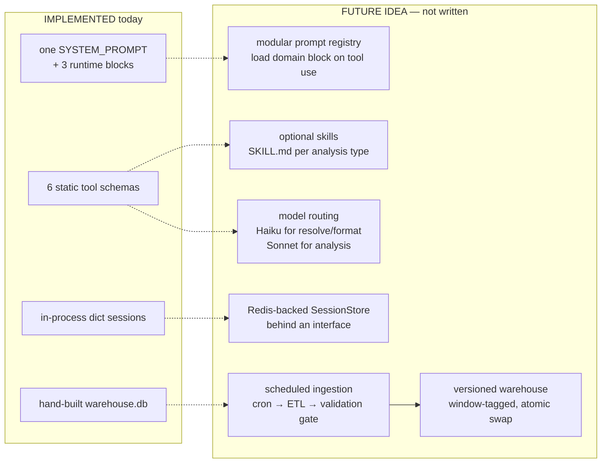

# Agent Architecture — Interview Guide

**Purpose:** present and defend the actual implementation.
**Method:** read-only audit of the code in this repository. Every claim below was
checked against a file, a line, or a command that was run. Line numbers are from
the working tree at the time of writing.
**Status key used throughout:**

| tag | meaning |
|---|---|
| **IMPLEMENTED** | present in the code and reachable from a production path |
| **TESTED** | covered by an assertion in the offline suite |
| **DOCUMENTED ONLY** | described in a doc, not enforced by code |
| **FUTURE IDEA** | not written; proposal only |

---

## A. Actual architecture

```mermaid
graph TB
    subgraph browser["Browser — React 19 + TypeScript (Vite)"]
        CHAT["chat.tsx<br/>message list + composer"]
        PANELS["panels.tsx<br/>ProfilePanel · RankPanel · ComparePanel<br/>LongHaulPanel · UnmetDemandPanel · TemporalPanel"]
        API["api.ts<br/>BASE = VITE_API_BASE ?? '/api'"]
    end

    subgraph backend["FastAPI — app/main.py"]
        CHATEP["POST /chat"]
        ANALYTICS["GET /analytics/*<br/>profile · compare · rank<br/>long-haul · unmet-demand · resolve"]
        META["GET /health · /sources · /config · /usage"]
        SESSEP["GET·DELETE /sessions/{id}"]
    end

    subgraph agent["app/agent — the model layer"]
        ORCH["orchestrator.py<br/>Orchestrator.chat()<br/>manual tool loop"]
        PROMPTS["prompts.py<br/>SYSTEM_PROMPT + 3 block builders"]
        TOOLS["tools.py<br/>TOOL_SCHEMAS (6) + ToolBox"]
        AUDIT["audit.py<br/>collect_numbers · audit_text<br/>render_fallback"]
        SESS["session.py<br/>Session · SessionStore (in-process dict)"]
        RETRY["retry.py<br/>classify() · NEVER_RETRY_STATUSES"]
        USAGE["usage.py<br/>TRACKER — tokens + cost estimate"]
    end

    subgraph analytics["app/analytics — deterministic, no model"]
        ENGINE["engine.py<br/>AnalyticsEngine"]
        SCORING["scoring.py — TDPI · ACI · classify()"]
        UNMET["unmet.py — UDEI indicators"]
        PERSIST["persistence.py — ACI temporal diagnostic"]
        LONGHAUL["longhaul.py"]
        METRICS["metrics.py · definitions.py · normalize.py · resolve.py"]
    end

    DB[("SQLite warehouse<br/>backend/app/data/warehouse.db<br/>read-only URI")]
    CLAUDE{{"Anthropic Messages API<br/>claude-sonnet-5"}}

    CHAT --> API --> CHATEP --> ORCH
    PANELS -.->|renders reply.tool_calls[].result| API
    ORCH --> PROMPTS & TOOLS & AUDIT & SESS & RETRY & USAGE
    ORCH <-->|messages.create| CLAUDE
    TOOLS --> ENGINE
    ANALYTICS --> ENGINE
    ENGINE --> SCORING & UNMET & PERSIST & LONGHAUL & METRICS
    ENGINE --> DB
    META --> ENGINE
    SESSEP --> SESS
```

**The load-bearing design decision:** the model never computes. Every number
originates in `app/analytics`, reaches the model only as a tool result, and is
re-checked against those results before the answer is returned. `/analytics/*`
bypasses the model entirely, so the deterministic product survives an LLM outage
(`main.py:1-11`).

---

## B. Request lifecycle

```mermaid
sequenceDiagram
    participant U as User
    participant FE as React (App.tsx)
    participant API as FastAPI /chat
    participant O as Orchestrator.chat
    participant S as Session
    participant C as Claude
    participant TB as ToolBox
    participant E as AnalyticsEngine
    participant A as audit_text

    U->>FE: types a question
    FE->>API: POST /chat {message, session_id}
    API->>API: has_api_key()? else 503 (main.py:125)
    API->>O: chat(message, session_id)
    O->>S: get_or_create (session.py:148)
    O->>S: turns += 1; append user msg; remember_numbers(message)
    O->>S: trim() to MAX_HISTORY_TURNS
    O->>O: system = [cached static prefix] + [session_state_block]

    loop up to MAX_TOOL_HOPS = 5 (orchestrator.py:316)
        O->>C: messages.create(model, max_tokens, system, tools, messages, output_config)
        C-->>O: content blocks + stop_reason
        Note over O: stop_reason == "refusal" → _error_reply
        O->>S: append assistant content
        alt no tool_use blocks
            O->>O: draft = concatenated text; break
        else hop budget exhausted
            O->>S: append "tool budget exhausted" user message
        else tool_use present
            loop each tool_use block
                O->>TB: call(name, input)  (orchestrator.py:367)
                TB->>E: engine method
                E-->>TB: full structured payload
                TB-->>O: result (or {"error": ...} on ToolError)
            end
            O->>S: append ONE user message with all tool_results<br/>(compact view via serialise_for_model)
        end
    end

    O->>O: _harvest → focus / ranking / comparison / scores
    O->>S: remember_prompt_numbers() + remember_numbers(compact projection)
    O->>A: audit_text(draft, known=session.known_numbers)
    alt audit fails
        O->>C: _regenerate — one retry framed as an automated check
        Note over O: still failing → render_fallback from tool output
    end
    O->>S: append assistant draft; trim()
    O-->>API: AgentReply
    API-->>FE: JSON
    FE->>FE: setTurns(...) and route tool_calls[].result to panels
    FE-->>U: prose (chat pane) + structured panels (analytics pane)
```

**Two payload widths, on purpose.** The model receives
`ToolBox.compact_for_model(...)` (`tools.py:356`+); the browser receives
`call.result`, the full payload, via `AgentReply.tool_calls[].result`
(`orchestrator.py:70`). Measured on the current warehouse:

| tool | full payload | model view | reduction |
|---|---:|---:|---:|
| `rank_airports` (New England) | 156,532 B | 13,240 B | 92% |
| `compare_airports` (LAX, SNA) | 29,163 B | 2,778 B | 91% |
| `get_airport_profile` (BOS) | 16,447 B | 3,092 B | 82% |
| `unmet_demand_evidence` (SFO) | 13,487 B | 3,287 B | 76% |
| `long_haul_breakdown` (ANC) | 9,196 B | 4,627 B | 50% |

---

## C. File-by-file responsibilities

### `backend/app/main.py` — 186 lines
HTTP surface only; no business logic.
- Builds the three process singletons at import: `AnalyticsEngine`, `SessionStore`,
  `Orchestrator` (`49-51`).
- CORS restricted to `localhost:5173` / `127.0.0.1:5173` (`41-47`).
- `ChatRequest` caps the message at 4,000 chars (`60`) — **application-enforced**.
- `POST /chat` returns **503** when no API key is configured, and says the
  analytics endpoints still work (`125-132`).
- `/analytics/*` calls the engine directly — no model in the path (`154-240`).
- `/health` exposes window, airport count, cohort size, ACI-eligible count,
  `llm_configured`, model, active session count (`73-85`).
- `/config` returns credential *status* and never the key (`93-96`, delegating to
  `config.describe_credentials()`).
- `long_haul` catches and re-raises as 500 with the real reason, because an
  earlier version collapsed every failure into a bare 404 (`226-232`).

### `backend/app/agent/orchestrator.py` — 417 lines
The agent loop. Deliberately manual rather than the SDK's beta `tool_runner`,
for three reasons stated at `1-7`: every call and result must be captured for the
structured response, the draft must be audited before return, and per-turn state
must be injected.
- `Orchestrator.__init__` (`138-158`) builds `_static_system` once =
  `SYSTEM_PROMPT` + `data_context_block(...)` + `limitations_block(...)`.
- `client` property (`160-169`) constructs `anthropic.Anthropic(max_retries=0)` —
  the SDK's blind retry is disabled so `retry.classify` governs instead.
- `_create` (`171-194`) one request with bounded classified retries + usage
  logging; raises `_ApiFailure` carrying user-facing text.
- `_run_tool` (`200-218`) converts `ToolError` into `{"error": ...}` with
  `is_error: true` rather than crashing the turn.
- `_harvest` (`224-268`) updates focus / ranking / comparison and collects score
  objects.
- `chat` (`285`+) the turn: history append, trim, system assembly, the hop loop
  (`316`), audit (`393`), regenerate-or-fallback (`396-398`), reply construction.
- `_auditable` (`54-73`) returns the **model-visible projection** of a tool result
  by calling `compact_for_model`, so the audit pool cannot include figures the
  model never saw.
- `_regenerate` (`426`+) one retry phrased as an automated check — a user-framed
  correction made the model apologise for something the user never said.
- `_error_reply` (`470`+) degraded reply with `error_category`.

### `backend/app/agent/prompts.py` — 292 lines
- `SYSTEM_PROMPT` (`10-279`): one triple-quoted string, **14,405 chars ≈ 3,600
  tokens**, 11 `#` sections.
- `data_context_block(sources, window)` (`282`) — provenance, sent once in the
  cached prefix instead of on every tool result.
- `limitations_block(limitations)` (`308`) — standing caveats, same rationale.
- `session_state_block(focus, ranking, assumptions, comparison)` (`317`) — the
  **only volatile** part, appended as a second system block after the cached one.

### `backend/app/agent/session.py` — 138 lines
- `Session` dataclass (`26-140`): `messages`, `focus_airports`, `last_ranking`,
  `last_comparison`, `assumptions`, `turns`, `created_at`, `known_numbers`,
  `audit_payloads`, `_prompt_numbers_loaded`.
- `trim()` (`109-128`) counts **real turn boundaries** via `_is_turn_start`,
  because a `tool_result` message also has `role: "user"`. The docstring records
  the bug this fixed: a `MAX_HISTORY_TURNS * 2` message budget retained only ~6
  real turns and silently dropped the long-haul result a follow-up needed.
- `SessionStore` (`143-168`): a plain `dict` behind a `threading.Lock`.
  **In-process; nothing is persisted.**

### `backend/app/agent/tools.py` — 614 lines
- `TOOL_SCHEMAS` (`33`) — six JSON-Schema tool definitions; `TOOL_NAMES` (`193`).
- `_r` / `_r_score` / `_r_minutes` — model-view rounding policy.
- `ToolBox.call` (`254-258`) dispatches through `self._handlers`; unknown name
  raises `ToolError` listing the valid names (`257`).
- `_require(iata)` (`524-542`) validates the code against the warehouse, offers
  resolver suggestions, and refuses an airport with no traffic in the window.
- `compact_for_model(name, result)` (`356`+) per-tool projection.
- `serialise_for_model` (`516`) — JSON for the `tool_result` block.

### `backend/app/agent/audit.py` — 167 lines
- `collect_numbers(payload)` (`76-111`) every number reachable in a payload, at
  natural scalings (×100, ÷100, ÷1e3, ÷1e6) — and it **parses numbers out of
  strings**, so display strings like `"82.6%"` are quotable.
- `_matches` (`114-125`) tolerance `max(0.05, |k| * 0.012)` — rounding is
  permitted by design.
- `audit_text` (`128`+) strips code spans, fenced blocks and links
  (`_STRIP_PATTERNS`, `49`), ignores years in `1900-2100` (`36`) and
  `_ALLOWED_BARE` (`32`), then checks each remaining numeral.
- `render_fallback` (`174`+) templated answer rendered straight from tool output.

### `backend/app/analytics/engine.py` — 379 lines
Deterministic entry point, model-free.
- `__init__` (`55`) opens SQLite **read-only** (`file:...?mode=ro`,
  `check_same_thread=False`) and eagerly loads `metrics` for all **401** airports.
- `cohort()` (`111`) cached per `(hub_class, region)` key; the default cohort is
  the **399** airports with traffic; `aci_eligible_size` is **237**.
- `profile` (`174`) scores then attaches the temporal diagnostic via
  `dataclasses.replace` — after scoring, so it cannot influence the score.
- `monthly_delay()` (`141`) and `_udei_cohort_context()` (`367`) are **lazy and
  cached**; ranking never triggers either.
- `rank` (`211`), `compare` (`292`), `long_haul` (`350`), `unmet_demand` (`411`).

---

## D. Tool inventory — 6 tools, all IMPLEMENTED and TESTED

| tool | required | optional | returns | implementation |
|---|---|---|---|---|
| `resolve_airports` | `queries: string[]` | — | resolutions with `ambiguous`, `interpretation`, `suggestions` | `analytics/resolve.py` |
| `get_airport_profile` | `iata` | `hub_class_cohort` | TDPI + ACI with full component derivation, divergence class, `temporal` | `engine.profile` |
| `compare_airports` | `iatas` (≥2) | — | volume vs per-flight intensity, split deliberately | `engine.compare` |
| `rank_airports` | `iatas` | `index` (TDPI\|ACI), `min_passengers` | ranked + unscored + skipped, with reasons | `engine.rank` |
| `long_haul_breakdown` | `iata` | `month_start`, `month_end` | 4 configuration scopes × 5 distance thresholds + reconciliation | `analytics/longhaul.py` |
| `unmet_demand_evidence` | `iata` | — | U1–U5 indicator table, band, counts, shared limits | `analytics/unmet.py` |

**Tool selection** is the model's own: all six schemas are sent on every request
(`orchestrator.py:323`) and Claude emits `tool_use` blocks. There is no router,
no classifier, no dynamic tool subset.

**Results return** as one `user` message containing every `tool_result` block for
that assistant turn (`orchestrator.py:371-378`) — batched, because the API
requires each `tool_use` to be answered in the same turn.

### What is NOT present — verified by repository-wide search

| mechanism | status |
|---|---|
| `SKILL.md` files / skill loading | **absent** — no file matching `SKILL`/`skill.md` anywhere |
| MCP | **absent** — no `mcp` import, no server config |
| LangChain / LangGraph | **absent** — zero matches in any `.py`, `.ts`, `.md`, `.json`, `.txt` |
| OpenAI SDK | **absent** |
| Dynamic tool loading | **absent** — `TOOL_SCHEMAS` is a module-level literal |
| SDK `tool_runner` | **deliberately not used** — rationale at `orchestrator.py:1-7` |

---

## E. Prompt and session architecture

### The prompt

**Where:** `backend/app/agent/prompts.py:10-279`, a single triple-quoted
`SYSTEM_PROMPT`. **Assembled from four parts at runtime**, not one blob:

```
system = [
  { text: SYSTEM_PROMPT + data_context_block(...) + limitations_block(...),
    cache_control: {type: "ephemeral"} },     # frozen, cacheable
  { text: session_state_block(...) },          # volatile, per turn
]
```
(`orchestrator.py:299-314`; assembly of the static part at `154-158`.)

**How it is passed:** as the top-level `system` parameter — a list of text
blocks, not a message. `orchestrator.py:11-15` records why: Sonnet 5 does **not**
support mid-conversation `role: "system"` messages, so per-turn state must be a
second system block after the cached prefix.

**Why it is long (14,405 chars ≈ 3,600 tokens):** almost all of it is
*anti-fabrication and calibration* rather than task description. The sections:

| section | line | nature |
|---|---:|---|
| The one absolute rule | 15 | general agent behaviour (never compute) |
| What the scores mean — and do not mean | 42 | **domain-specific** |
| Uncertainty and scope, every time | 130 | general |
| Long-haul questions | 140 | **domain-specific** |
| Unmet demand | 158 | **domain-specific** |
| Congestion comparisons | 211 | **domain-specific** |
| You are one half of a two-pane interface | 217 | product-specific |
| Answer structure | 235 | general |
| Calibrated language | 246 | general |
| Working style | 270 | mixed |

**Domain-specific:** the score semantics (TDPI/ACI are proxies, not capacity
measurements), the divergence-class readings, long-haul threshold and
aircraft-configuration handling, the UDEI three-part structure and its limits,
the volume-vs-intensity separation.

**General agent behaviour:** never calculate; never state an unsourced figure;
rounding permitted, deriving not; missing ≠ low; answer structure; calibrated
language; figure formatting.

**Could safely be modularised** (FUTURE IDEA, §J): the three domain blocks
(long-haul, unmet demand, congestion comparisons) are only relevant when the
corresponding tool is called. They are roughly 40% of the prompt and are paid for
on every turn — though the cached prefix makes that cheap after the first
request.

**Duplication and drift found:**

1. **Real duplication — prompt ↔ tool payloads.** The UDEI section states the
   band rule, the U2/U3 dependence and the quantification refusal; the
   `unmet_demand_evidence` payload restates them in `limits`. This was
   *deliberate* after the Phase 8.3 optimisation (the payload carries one-line
   forms, the prompt the full rule), but it is duplication and worth naming as
   such.
2. **Near-duplication inside the prompt.** "Never state a number of unmet
   passengers" appears in the Unmet-demand section and again, in substance, in
   Calibrated language.
3. **No conflicting instruction found.** I checked the MIXED-class wording, the
   TDPI/ACI disclaimers and the figure-formatting rules for contradictions and
   found none — the MIXED wording was corrected in Phase 8.3 to stop claiming
   both indices are mid-range.
4. **No outdated instruction found** against the current tool set: every tool the
   prompt mentions exists, and the prompt mentions no tool that does not.

### Session

| question | answer | evidence |
|---|---|---|
| What is retained between turns? | `messages`, `focus_airports`, `last_ranking`, `last_comparison`, `assumptions`, `turns`, `known_numbers`, `audit_payloads` (last 40) | `session.py:26-44` |
| How many previous messages? | last **12 conversational turns** (`MAX_HISTORY_TURNS`, env-overridable), counted at real turn boundaries | `config.py:38`, `session.py:109-128` |
| Are tool calls and results retained? | **Yes** — `tool_use` and `tool_result` blocks stay in `messages` and are re-sent each request | `orchestrator.py:345`, `378` |
| Truncation / token budget? | Turn-count trimming only. **No token-based budget.** Cuts only at turn boundaries so a `tool_use` is never separated from its `tool_result` | `session.py:119-123` |
| How are "these airports" / "the second one" resolved? | Not by the model guessing: `session_state_block` injects focus, the ordered ranking and the last comparison as explicit state | `prompts.py:317-346` |
| After backend restart? | **All sessions are lost.** `SessionStore` is a `dict` in process memory | `session.py:145` |
| Isolated between users? | Only by session id. There is **no authentication** — anyone who knows an id can read it via `GET /sessions/{id}` | `main.py:136-141` |
| Invalid session id? | `GET /sessions/{id}` → 404. On `POST /chat`, an unknown id is **adopted as the id of a brand-new session** (not rejected) | `main.py:140`, `session.py:150-155` |
| In memory or persisted? | **In memory only.** No Redis, no DB, no file | `session.py:1-4` |

#### Deterministic session tests — **IMPLEMENTED and TESTED in Phase 8.4**

All four now exist in `backend/tests/test_session_continuity.py` (15 tests,
offline with a scripted fake client). Writing them found the falsy-store bug in
§I.1b. The originals as proposed: — all four are offline with a fake client:

1. **Ordinal follow-up.** Seed `last_ranking = [HVN, BOS, BGR]`; assert
   `session_state_block` contains `2. BOS`; assert a fake-client turn asking
   "why the second one?" issues `get_airport_profile(iata="BOS")`.
2. **Comparison persistence.** `set_comparison([LAX, SNA])`, then two unrelated
   turns, then assert `last_comparison` still appears in the state block — the
   field exists precisely because focus changes faster than comparisons.
3. **Isolation.** Two `chat()` calls with different ids; assert
   `store.get(a).messages` and `...get(b).messages` are disjoint and that
   `known_numbers` do not leak between them.
4. **Trim boundary integrity.** Drive 20 tool-using turns, then assert that in
   `session.messages` every `tool_use` id has a matching `tool_result` — the
   invariant `trim()` exists to protect.

---

## F. Guardrails

Classification: **P** prompt-based (soft), **A** application-enforced,
**S** tool-schema-enforced, **D** deterministic validation.

| # | Guardrail | Class | Implementation |
|---|---|---|---|
| 1 | Model never calculates | **P** + **A** | Prompt `prompts.py:15-41`; enforced in practice because every figure the model can quote must exist in a tool payload (guardrail 3) |
| 2 | Numeric provenance audit | **D** | `audit.py:128` `audit_text`; pool = `session.known_numbers`, built from `remember_prompt_numbers()` + `_auditable(...)` per call (`orchestrator.py:384-389`) |
| 3 | Audit pool = model-visible only | **D** | `_auditable` returns `compact_for_model(...)` (`orchestrator.py:54-73`). Measured: UDEI pool 164 → 57 values |
| 4 | Audit failure recovery | **A** | One regeneration framed as an automated check (`_regenerate`, `426`); then `render_fallback` — templated answer from tool output |
| 5 | Unknown tool name | **D** | `ToolBox.call` raises `ToolError` listing valid names (`tools.py:257`) |
| 6 | Unknown / traffic-less airport | **D** | `_require` (`tools.py:524-542`) — rejects, suggests alternatives, refuses no-traffic airports |
| 7 | Tool argument constraints | **S** + **D** | JSON Schema `required`/`enum` in `TOOL_SCHEMAS`; plus runtime checks — ≥2 airports for compare (`606`), ≥1 for rank (`616`), index ∈ {TDPI, ACI} (`619`) |
| 8 | Tool exception containment | **A** | `_run_tool` returns `{"error": ...}` with `is_error: true`; the turn continues (`200-218`) |
| 9 | Max tool iterations | **A** | `MAX_TOOL_HOPS = 5` (`config.py:35`); at the ceiling the model is told the budget is spent and must state what it could not look up (`orchestrator.py:352-363`) |
| 10 | Output token cap | **A** | `MAX_TOKENS = 8000` (`config.py:30`) passed as `max_tokens` |
| 11 | Input size cap | **A** | `ChatRequest.message` `max_length=4000` (`main.py:60`) |
| 12 | History growth cap | **A** | `MAX_HISTORY_TURNS = 12`, `Session.trim()` |
| 13 | Retry policy | **D** | `retry.py` — `NEVER_RETRY_STATUSES = {400,401,402,403,404,405,422}` (`33`); SDK retry disabled via `max_retries=0`; credit/quota 429s are not retried |
| 14 | Missing-data disclosure | **D** | Structural: suppressed scores return `null` + a reason; UDEI indicators carry `triggered: null` + `unavailable_reason`; `UnmetDemandEvidence` **has no magnitude field** (`models.py`) |
| 15 | No fabricated magnitude | **D** | The schema cannot hold one. TESTED by key-inspection, not substring search |
| 16 | Missing API key | **A** | 503 with a message pointing at `/analytics/*` (`main.py:125-132`) |
| 17 | Model refusal | **A** | `stop_reason == "refusal"` → `_error_reply` (`340-343`) |
| 18 | Credential non-disclosure | **A** | Key read from env only; `/config` returns status, length and prefix-ok — never the value (`config.py:60-73`) |
| 19 | CORS restriction | **A** | Two explicit localhost origins (`main.py:41-47`) |
| 20 | SQLite read-only | **A** | `file:...?mode=ro` URI (`engine.py:55`) |
| 21 | Out-of-domain questions | **P only** | `prompts.py:276-278` — "If asked about non-US airports, forecasts, or profitability, say plainly that those are outside what this system measures." **Soft.** The hard boundary is that no tool can return such data |
| 22 | Profitability claims | **P only** | `prompts.py:125` |

**Honest statement of the boundary.** Guardrails 1, 21 and 22 are prompt
instructions and are **not** security controls — a model can ignore them. What is
actually enforced is narrower and stronger: the tool surface exposes six
functions over one read-only warehouse, so there is no data path to a non-US
airport, a forecast or a cost figure; and any numeral in the answer that is not
traceable to a model-visible payload triggers regeneration and then a templated
fallback. The system constrains *what can be said with numbers*, not *what the
model may be persuaded to discuss*.

One consequence worth conceding in interview: the numeric audit is a
**provenance** check, not a semantic one. It verifies that a number exists in what
the model was shown — not that it is the right number for the sentence. A
figure correctly copied into a wrong claim passes.

---

## G. Verified dependency inventory

Installed in `backend/.venv` (from `pip list`), versus what the file declares:

| library | installed | in `requirements.txt` | purpose |
|---|---|---|---|
| `anthropic` | **1.8.0** | commented out, as `0.42.0` | Messages API client — used **directly**, no wrapper |
| `fastapi` | **0.141.1** | commented out, as `0.115.6` | HTTP API |
| `uvicorn` | **0.54.0** | commented out, as `0.34.0` | ASGI server |
| `python-dotenv` | **1.2.3** | commented out, as `1.0.1` | `.env` loading |
| `pydantic` | 2.13.5 | transitive | request validation |
| `starlette` | 1.7.0 | transitive | FastAPI core, `TestClient` |
| `httpx` | 0.28.1 | transitive | `TestClient` transport |
| `requests` | 2.32.3 | **declared** | ETL downloads |
| `openpyxl` | 3.1.5 | **declared** | FAA `.xlsx` workbooks |
| `pytest` | 8.3.4 | **declared** | 549-test offline suite |

**Frontend** (`frontend/package.json`): runtime dependencies are **only**
`react ^19.2.8` and `react-dom ^19.2.8`. Dev: `typescript ~6.0.2`, `vite ^8.3.0`,
`@vitejs/plugin-react ^6.1.1`, `oxlint ^1.81.0`, `@types/*`. **No charting
library, no UI kit, no state manager** — the panels are hand-built tables and CSS
bars, and `styles.css` carries the design tokens and dark mode.

| framework | present? |
|---|---|
| Anthropic SDK used directly | **yes** — `anthropic.Anthropic(...).messages.create(...)` |
| LangChain | **no** |
| LangGraph | **no** |
| MCP | **no** |

**Why Python suits this architecture:** the deterministic core is the product, and
it is data work — SQLite, CSV/XLSX ingest, percentile and winsorization maths.
`sqlite3`, `csv`, `zipfile` and `urllib` are stdlib, so the ETL has almost no
dependencies (`requirements.txt:1-3` states this intent). The scoring is pure
Python with no NumPy/SciPy — deliberately, so Spearman and percentile behaviour
are auditable in the repository rather than delegated. FastAPI gives typed
request validation for free, and the Anthropic Python SDK is first-party.

**Where TypeScript is used:** the entire frontend — `api.ts` (fetch layer),
`types.ts` (~330 lines mirroring the backend response contracts), `App.tsx`
(state and routing of `tool_calls` to panels), `components/panels.tsx` (~1,000
lines of structured renderers), `chat.tsx`, `primitives.tsx`, `glossary.ts`,
`markdown.ts`. The types matter because the panels must never parse numbers out
of prose — they read named fields, so a contract change is a compile error rather
than a silent mis-render.

---

## H. Fourteen interview questions

**1. Why a manual tool loop instead of the SDK's `tool_runner`?**
Three things the runner does not expose, all of which this deliverable needs
(`orchestrator.py:1-7`): every tool call and result captured for the structured
API response the frontend renders; a numeric audit over the draft *before* it is
returned; and per-turn session state injected as a second system block. It also
keeps the submission off a beta dependency. The cost is ~60 lines of loop I own.

**2. How do you stop the model inventing numbers?**
Four layers, only the first of which is the prompt. The model is told never to
calculate. It is given tools that return pre-computed values, so there is nothing
to calculate from. Every numeral in the draft is checked against the numbers the
model was actually shown — and since Phase 8.3 that pool is derived from
`compact_for_model` itself, so a figure that exists only in the frontend payload
cannot validate an answer. On failure: one regeneration, then a templated answer
rendered directly from tool output. The strongest control is structural, though:
`UnmetDemandEvidence` has **no magnitude field**, so "unmet passengers" has
nowhere to live.

**3. Why is the system prompt 3,600 tokens?**
Because most of it is calibration, not instruction. The indices are proxies that
would be easy to over-claim — "high TDPI" must never read as "terminal capacity
is short" — so the prompt carries the semantics of each score, what each cannot
establish, and the exact language to use. It sits in a `cache_control: ephemeral`
prefix, so it is written once and read cheaply thereafter. If I were optimising
further I would move the three tool-specific sections (long-haul, unmet demand,
congestion) behind the corresponding tool call, which is about 40% of it.

**4. How do follow-up questions work?**
Not by hoping the model remembers. `_harvest` extracts focus airports, the
ordered ranking and the last comparison from tool results, and
`session_state_block` injects them as explicit state: *"Most recent ranking (use
this to resolve ordinal references such as 'the second one'): 1. HVN, 2. BOS…"*.
`last_comparison` is tracked separately from focus because focus changes faster
than the comparison a user means by "add Boston to that".

**5. What happens if the LLM is down?**
`/analytics/*` has no model in the path, so every figure is still served. `/chat`
returns a degraded reply that names the failure category and points at those
endpoints. `retry.py` refuses to re-send authentication, billing or
malformed-request failures — retrying a 402 just burns money.

**6. Is the session store production-ready?**
No, and deliberately so. It is a `dict` behind a lock, in process memory: a
restart loses everything, and there is no authentication, so session isolation
rests on id secrecy alone. For a demo that is the right trade — Redis would add
infrastructure without changing observable behaviour at this scale. For
production I would move `SessionStore` behind an interface and back it with Redis
keyed by an authenticated user id, with a TTL.

**7. Why six tools rather than one general query tool?**
Each tool maps to a question type the deliverable must answer, and each returns a
*shaped* payload the frontend can render without interpretation. A general
"run this SQL" tool would move the analytical decisions into the model's output,
which is exactly what this design keeps out. Narrow schemas also give free
argument validation and make the audit pool predictable.

**8. How do you keep token usage down?**
Two payload widths. The model gets `compact_for_model`; the browser gets the full
payload. Measured: 92% smaller for a 16-airport ranking, 76% for the UDEI table.
The static system prefix is cached. Static provenance and limitations are sent
once in that prefix instead of on every tool result, where they would ride along
in history for the rest of the conversation. Index scores round to one decimal in
the model view while full precision stays in the payload. `usage.py` records
input, output, cache-read and cache-write tokens separately with a cost estimate,
exposed at `/usage`.

**9. What is the weakest part of the design?**
The UDEI evidence band. It counts triggered indicators on absolute thresholds
while the number of *evaluable* indicators varies by airport, so bands are not
comparable: IAG fires 3 of 3 and bands Moderate, ROC fires 4 of 4 and bands
Strong, though both are everything that could be measured — and 162 of 399
airports cannot reach the top band at all because their ACI is suppressed. I
audited it, chose to *disclose* rather than re-tune it for compatibility, and the
payload now carries `max_attainable_triggered`. It is still a weakness.

**10. Tell me about a time the data contradicted your design.**
Twice, and both changed the outcome. I proposed a TDPI v2c whose level anchor was
passengers per departure; measuring it showed Spearman **+0.979** against seats
per departure, i.e. it was aircraft gauge relabelled — the very component I was
trying to reduce reliance on — so I recommended against my own proposal. And for
the SFO unmet-demand question I expected constrained supply; SFO added flights
**faster** than passengers (+4.2% vs +3.4%) with gauge *falling*, and its
slot-constrained peers band Moderate while SFO bands Weak. The honest answer is
that the evidence points away from a binding constraint.

**11. How would you benchmark Sonnet against Haiku here?**
**Done — see the model-choice subsection of `design-document.md` §11.** A
controlled five-scenario comparison against **Claude Haiku 4.5**, reusing the
Phase 9 evaluation bank with the prompt, tools, analytics, sessions and audit held
constant. Haiku was materially cheaper on the sample and correct on tool
selection, conversational context and several guardrails, but regressed on
calibrated interpretation — it misread the UDEI band mechanism (treating data
availability as moving a band threshold rather than the attainable ceiling) and
derived a percentage against the no-calculation rule, which the provenance audit
passed only because the value coincidentally matched an unrelated number. It also
rejects the production `output_config` effort parameter. **Decision:
RETAIN_SONNET** — semantic/calibration regression despite the lower cost, for
this project and this sample; five scenarios prove nothing general.

The method below is what that run used, and the rest still applies for a larger
benchmark: the four exam questions are a fixed checklist in
`smoke_test.py`, each with explicit acceptance criteria ("reports U5 as
unavailable, not as not-triggered"). Because the analytics are deterministic, the
*tool results* are identical across models, so the only variable is the narration
and the tool-selection sequence. I would run each question N times per model with
`--fresh`, and score four measurable things: checklist pass rate, numeric-audit
pass rate, tool-call count and sequence, and tokens plus latency from `/usage`.
That gives a defensible cost-versus-compliance curve without me asserting
anything unmeasured.

**12. Where does the model choose, and where is it forbidden to?**
It chooses which tools to call, in what order, with what arguments, and how to
narrate. It is forbidden from producing any number not in a tool result — checked
mechanically — and it cannot reach data outside the six tools. It never picks
weights, thresholds or classifications: those are constants in
`analytics/definitions.py` with tests pinning them.

**13. What would you do first with another week?**
Replace `requirements.txt`, which currently does not install the backend
(§I.1) — that is a reproducibility bug, not a nice-to-have. Then persistent
sessions behind an interface, then ingest the BTS Consumer Airfare dataset so
UDEI's U5 stops being unavailable for all 399 airports: it is the only indicator
that observes a market's own pricing response rather than an operational outcome.

**14. How do you know the analytics are right?**
549 offline tests, no live API calls, with checksums pinning aggregate behaviour:
Σ TDPI 16146.9211 and Σ ACI 10931.2699 are asserted bit-identical, so any change
to a weight or a formula fails loudly. Component arithmetic is tested against
hand-computed fixtures, suppression rules are tested for *reporting the reason*
rather than returning zero, and the counterfactual machinery in the temporal
diagnostic is tested to reproduce the published score exactly when nothing is
removed. Where I could not verify something — the frontend production build, for
instance, because there is no Node runtime in my environment — the reports say so
explicitly rather than implying it passed.

---

## I. Current limitations

1. ~~**`requirements.txt` does not install the backend.**~~ **FIXED in Phase
   8.4.** All runtime dependencies are now declared and pinned, and the
   documented install-and-start procedure was verified in an empty virtual
   environment: 549 tests passed and `/health` returned 200. See
   `docs/phase-8.4-reproducibility.md`.
1b. **A dependency-injection bug found while writing the session tests, now
   fixed.** `SessionStore` defines `__len__`, so an **empty store is falsy**, and
   `Orchestrator.__init__` used `store or SessionStore()` — silently discarding
   the store `main.py:51` passes it. The app therefore held two stores:
   `/health.active_sessions` always read **0**, `GET /sessions/{id}` always
   404'd, and `DELETE /sessions/{id}` reset a store nothing used. Now
   `store if store is not None else ...`, with two regression tests.
2. **Sessions are in-process and unauthenticated.** Restart loses all state;
   isolation depends on session-id secrecy; an unknown id on `/chat` silently
   creates a session under that id rather than rejecting it. **TESTED** as of
   Phase 8.4 (`tests/test_session_continuity.py`) — pinned as documented
   behaviour, not fixed.
3. **No token-based history budget.** Trimming counts turns, so 12 tool-heavy
   turns carry far more context than 12 conversational ones.
4. **Out-of-domain refusal is prompt-only.** Mitigated by the narrow tool surface,
   but it is not a hard boundary.
5. **The numeric audit is provenance, not semantics.** A correct number in a wrong
   claim passes.
6. **UDEI bands are not comparable across airports** (§H.9) — disclosed, not fixed.
7. **U5 is unavailable for all 399 airports**, so no band has ever included the
   pricing indicator.
8. **One analysis window.** Everything is 2025-05..2026-04; no cross-window
   stability testing exists.
9. **No ground truth.** No dataset records which airports actually needed
   investment, so TDPI, ACI and UDEI are validated for internal consistency and
   conceptual soundness only — never predictive accuracy.
10. **Frontend build unverified in the authoring environment** — no Node runtime;
    verified separately on Windows.
11. **`tools` are not inside the cached prefix.** Only the system text carries
    `cache_control` (`orchestrator.py:304`); the six schemas are re-sent
    uncached each request.
12. **Single-process singletons.** One `AnalyticsEngine` and one `SessionStore`
    are module-level (`main.py:49-51`), so horizontal scaling would need the
    session store extracted first.

---

## J. Proposed future architecture — **NOT IMPLEMENTED**

Every item below is a **FUTURE IDEA**. None exists in the code.



| idea | what it would change | why not now | risk |
|---|---|---|---|
| **Modular prompts** | Load the long-haul / unmet-demand / congestion blocks only when that tool is called; ~40% smaller base prompt | The cached prefix already makes the static prompt cheap, so the saving is small and it adds a failure mode (block missing when needed) | Medium — a dropped block silently loosens calibration |
| **Optional skills** | `SKILL.md` per analysis type, loaded on demand | No skill-loading mechanism exists; six tools do not justify one | Low value at this size |
| **Model routing** | Haiku for `resolve_airports` and formatting, Sonnet for analytical narration | Needs the §H.11 benchmark **first** — routing without measured equivalence trades correctness for cost blindly | High if done before measuring |
| **Persistent sessions** | `SessionStore` behind an interface, Redis implementation, TTL, authenticated user key | Demo scale does not need it | Low — well-understood |
| **Scheduled ingestion** | Cron-driven ETL with a validation gate that refuses to publish a bad warehouse | ETL is currently a manual `python -m etl.build_warehouse` | Medium — needs the gate, or bad data ships automatically |
| **Versioned warehouse refresh** | Window-tagged warehouse files with atomic swap, so a refresh cannot half-apply | Single pinned window today | Medium — must keep the analysis window pinned per request |

---

## K. Recommended changes, prioritised

Ranked by interview value × necessity ÷ risk.

| # | Change | Value | Risk | Necessity |
|---|---|---|---|---|
| ~~1~~ | ~~Fix `requirements.txt`~~ | — | — | **DONE (Phase 8.4)** — verified by clean-venv install + startup |
| ~~2~~ | ~~Add the four session tests from §E~~ | — | — | **DONE (Phase 8.4)** — 15 tests; found the falsy-store bug |
| 3 | Put `tools` in the cached prefix alongside the system text | Medium — a clean, measurable token win | Low | Nice |
| 4 | Add a token-based history budget beside the turn count | Medium — names a real limitation and fixes it | Low | Nice |
| 5 | Extract `SessionStore` behind an interface (no Redis yet) | Medium — shows the seam without adding infrastructure | Low | Nice |
| ~~6~~ | ~~Run the §H.11 Sonnet/Haiku benchmark~~ | — | — | **DONE** — Haiku 4.5 on five scenarios; **RETAIN_SONNET** (calibration regression despite lower cost) |
| 7 | Ingest BTS Consumer Airfare for U5 | High analytically | Medium — new ETL path, new failure modes | Later |
| 8 | Modularise the three domain prompt blocks | Low — small saving, real risk | Medium | Later |

**Do not do before the interview:** model routing (unmeasured), a UDEI band
rework (deliberately deferred; disclosure was the approved decision), or anything
touching the pinned analysis window.

---

## Audit findings — documentation vs code

Statements in existing documentation that are **inconsistent with the code**:

1. **`backend/requirements.txt:9-13` — "commented until used".** They *are* used.
   `fastapi`, `uvicorn`, `anthropic`, `python-dotenv` are imported by
   `app/main.py`, `app/agent/orchestrator.py` and `app/agent/config.py`. The file
   also pins versions that do not match reality: `anthropic==0.42.0` commented
   versus **1.8.0** installed. **This is the one finding that breaks a fresh
   clone**, given `README.md:137`.
2. **`design-document.md:509` — "Six tools, each a thin wrapper over the engine.
   None computes anything."** The count and the spirit are right, but
   `compact_for_model` in `tools.py` now *does* compute presentation values —
   rounding index scores to one decimal, minutes to two, and deriving the
   `evidence`/`limits` blocks for UDEI from module constants. Worth rewording to
   "none computes an analytical value".
3. **`docs/phase-8.2b-aci-temporal-integration.md` §5** describes `_auditable()`
   as stripping the monthly series by name. That was true then; Phase 8.3
   replaced it with the `compact_for_model` projection
   (`orchestrator.py:54-73`). The Phase 8.3 report records the change, but the
   8.2b text now describes a superseded implementation.
4. **`README.md:80` — "manual tool-calling loop"** is accurate; noted only
   because I verified it rather than assuming.

Checked and found **consistent**: Sonnet 5 as the configured model
(`config.py:23`, README, DEMO), six tools (`TOOL_NAMES`), max 5 tool hops
(`design-document.md:61` vs `config.py:35`), "401 airports" in `DEMO.md:31`
(matches `len(engine.metrics)` = 401, correctly distinct from the 399-airport
cohort), no LangChain/LangGraph/MCP claims anywhere, and the absence of a
magnitude field in `UnmetDemandEvidence`.

**Files created by this audit:** `docs/agent-architecture-interview-guide.md`
(this document). **No production file was read-modified; nothing was installed,
downloaded, committed or pushed.**
